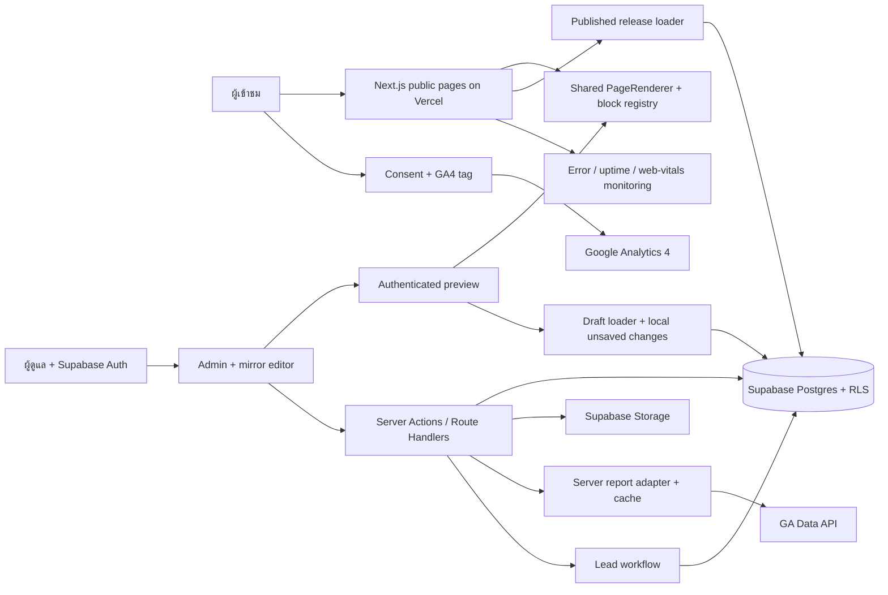

# Telemart Ubon — proposed renovation architecture

สถานะ: **เลือก A+B+C แล้ว เตรียม architecture/dependencies สำหรับ dev handoff** ติดตั้ง Supabase JS, Supabase SSR, Zod และ GA Data client แบบ exact versions ใน package manifest/lockfile รวมถึง skills เตรียมงาน 4 รายการ เว็บยังใช้ implementation เดิม ยังไม่ได้สร้าง CMS ใหม่ เชื่อม application กับ Supabase เปลี่ยน schema หรือ deploy

อัปเดต M1 (2026-09-29): สร้างแล้ว — Next 16.3.7/React 19.3.0, design tokens, route group `(public)` + หลังบ้าน `/admin`, Supabase SSR Auth แบบ Admin role เดียว, migration `admin_memberships`/`audit_log` พร้อม RLS และ CI ทดสอบกับ Supabase local stack และ CI บน GitHub; 30 ก.ย. เจ้าของ apply migration ที่ dev project และสร้าง Admin คนแรกแล้ว (เจ้าของแจ้ง) ยังไม่ deploy ดู [M1-FOUNDATION.md](M1-FOUNDATION.md)

Supabase target: **ผู้ใช้สร้าง resource แล้ว และตรวจ metadata/query ผ่าน MCP สำเร็จ** ใช้ project `wdcbbjvxrcxuaabcipqo` ใน organization `telemart-ubon` ตามรายละเอียด section 6 พร้อมสำหรับ dev handoff; application Auth/CMS/schema ยังไม่ได้ทำ และยังไม่ใช่ระบบ live

ตรวจเอกสารและเวอร์ชัน: **2026-09-29 (Asia/Bangkok)**

## 1. เป้าหมายและขอบเขต

สร้างเว็บโปรโมตเน็ตบ้าน แพ็กเกจมือถือ และโซลาร์เซลล์ รับ lead/คำขอให้ติดต่อกลับทั่วประเทศ ใช้สีขาว แดง ดำตามแนวทางแบรนด์ True โดยให้ผู้ดูแลแก้ทุกข้อความ รูป ปุ่ม ลิงก์ พื้นหลัง และเนื้อหาการขายได้จากหน้าที่เหมือนเว็บจริง

คำตอบที่ล็อกแล้ว: **A+B+C** ใช้แนวทางหน้าเปิดของ Minimal Workflow SaaS, ส่วนเปรียบเทียบโปรของ SaaS Pricing Flow และ composition ภาพเทคโนโลยีขนาดใหญ่ของ NEX Robotics ปรับให้เป็น **3D hero ของ Router Wi-Fi ทรู** และสีขาว แดง ดำ; **layout คงที่**, หลังบ้านมี **Admin role เดียว** ดูแล content และตรวจ IT; hosting ใช้ **Vercel กับโดเมนที่มีอยู่** ผู้ใช้มอบหมายให้เลือก Three.js, Higgsfield หรือวิธีคุณภาพเหมาะสมสำหรับ visual ได้

Business scope ยืนยันแล้ว: **lead/ติดต่อกลับเท่านั้น ไม่มี checkout หรือชำระเงินในเว็บ**, **รับคำขอทั่วประเทศและคงบริการโซลาร์เซลล์**, และ **Supabase ใหม่แยกสำหรับเว็บนี้** ผู้ใช้สร้างจริงเป็น organization **telemart-ubon** และ project **Jaycop-AFK's Project** ซึ่งตรวจผ่าน MCP แล้ว ให้ใช้ชื่อ/region ที่มีจริงตาม section 6 แทนชื่อ proposed เดิม Conversion หลักคือคำขอที่ server รับและบันทึกสำเร็จ การคลิกโทร/LINE เป็น contact intent ที่รายงานแยก การรับคำขอทั่วประเทศไม่ได้รับรองว่า fibre ติดตั้งได้ทุกที่ ต้องยืนยัน coverage ตามที่อยู่จริง; โซลาร์ต้องตรวจพื้นที่หน้างานและกำลังรองรับของทีมก่อนยืนยันการติดตั้ง เนื้อหา ราคา สิทธิประโยชน์ และเงื่อนไขใช้ข้อมูลที่ธุรกิจยืนยัน Dev เริ่มด้วย proposed defaults ใน section 13 โดยเรื่องภาษา/integrations/งบที่เหลือไม่ต้องหยุดงาน local เพื่อรอทุกคำตอบ

A+B+C คงเป็นทิศทางภาพ/องค์ประกอบที่เลือก ส่วน implementation ใช้ custom design brief ของเราและ **Rocket Pricing free prompt ที่เรียกคืนฉบับเต็มได้แล้ว** เป็นฐานปรับส่วนแพ็กเกจ Prompt เต็มของ A/B/C ยัง locked/premium; ยังไม่มีการซื้อ subscription หรืออ้างว่าได้ prompt เหล่านั้นแล้ว

Higgsfield เป็นทางเลือกสำหรับกราฟิกประกอบและวิดีโออธิบายบรรยากาศ/บริการ ให้เลือกวิธีตามคุณภาพของงาน ส่วนภาพสินค้า โลโก้ และอุปกรณ์ใช้ไฟล์จริงที่ธุรกิจมีสิทธิใช้งาน พร้อมระบุแหล่งที่มาใน media library การเรียก MCP ในช่วงผลิตสื่อเป็น workflow ของทีมพัฒนา; การเปิดให้แอดมินกดสร้างสื่อภายในเว็บเองต้องตรวจ API, credential, quota และสิทธิแยกต่างหาก

ประเภทอุปกรณ์ยืนยันเป็น Router Wi-Fi ของทรูแล้ว จึงเดินหน้า architecture/design ของ hero ได้ รุ่น/SKU ยังไม่ระบุ: วางแผนโมเดลประกอบการนำเสนอได้ แต่ไม่อ้างว่าตรงกับเครื่องรุ่นใดหรือเติมพอร์ต สเปก และรายละเอียดแบรนด์ที่ยังไม่มี reference เมื่อมีภาพ/model source ที่ยืนยันภายหลังจึงรับรอง exact-device match เสนอ Three.js/React Three Fiber เป็น Client Component เฉพาะ visual, แสดง poster ที่เหมาะสมตั้งแต่แรก แล้วค่อย lazy-load canvas/model; มี static fallback สำหรับ reduced motion, WebGL unavailable/context loss และอุปกรณ์ที่มีข้อจำกัดด้าน memory/performance Layout และพื้นที่ของ visual ต้องคงเดิมทั้ง poster และ canvas เพื่อไม่ให้หน้าเลื่อนกระโดด การใช้ `next/dynamic` แบบ `ssr: false` ต้องอยู่ใน Client Component ตามเอกสาร [Next.js lazy loading](https://nextjs.org/docs/app/guides/lazy-loading)

## 2. โครงสร้างระบบที่เสนอ

ใช้ Next.js App Router หนึ่งแอป แบ่ง public, admin, preview และ integration อย่างชัดเจน มี server boundary สำหรับการ publish, lead intake และรายงานที่ใช้ credential

โครงไฟล์ต่อไปนี้เป็น **โครงเสนอหลังอนุมัติ** M1 สร้างแล้วเฉพาะ `src/app/(public)/` (ย้ายหน้าเดิม), `src/app/admin/` (เข้าสู่ระบบ/ไม่มีสิทธิ์/console), `src/lib/supabase/`, `src/lib/auth/`, `supabase/migrations/` และ `tests/`; ส่วนอื่นยังเป็นข้อเสนอ:

| ส่วน | ตำแหน่งเสนอ | ความรับผิดชอบ |
| --- | --- | --- |
| หน้าสาธารณะ | `src/app/(public)/` | หน้าแรก เน็ตบ้าน มือถือ โซลาร์เซลล์ บริการ รายละเอียดโปร ตรวจพื้นที่/ขอติดต่อกลับ |
| หลังบ้าน | `src/app/admin/` | dashboard, mirror editor, catalog, media, lead inbox, reports, IT checks, settings |
| Preview | `src/app/preview/` | render draft สำหรับผู้มีสิทธิเท่านั้น ไม่บันทึก analytics |
| Renderer | `src/components/site/` | components และ CSS ชุดเดียวกันทั้ง public/preview |
| Editor | `src/components/editor/` | selection overlay, field panel, responsive viewport, autosave state |
| Content | `src/lib/content/` | schemas, bindings, block registry, draft/release loaders |
| Supabase | `src/lib/supabase/` | browser/server clients, cookie/session refresh |
| Integrations | `src/lib/analytics/`, `src/lib/leads/`, `src/lib/media/` | GA4/Data API, lead lifecycle, media validation |
| Schema | `supabase/migrations/` | migration ที่ตรวจแล้วและสร้างผ่าน Supabase CLI |
| Verification | `tests/` | high-impact acceptance, RLS และ publish/rollback checks |

## 3. Mirror CMS: เหมือนหน้าบ้านจริงและแก้ทันที

หัวใจคือ **PageRenderer ตัวเดียว + document schema ตัวเดียว** Public loader อ่าน published release; preview loader อ่าน draft แล้วนำ local edits มา render ผ่าน components ชุดเดียวกัน ใช้ CSS, font, breakpoints, asset cropping และ motion configuration ชุดเดียวกัน ไม่สร้าง HTML หน้าจำลองอีกชุด

ให้หลังบ้านเปิดหน้าเว็บจริงใน preview viewport เต็มพื้นที่ มีปุ่ม **ดูหน้าเว็บ / แก้ไข** เมื่อกด edit สามารถคลิกตำแหน่งบนหน้า เช่นรูปหรือข้อความของการ์ด “ลูกค้าใหม่” แล้วแก้ใน panel แอดมินเห็นผลทันทีระหว่างพิมพ์โดยยังไม่เปลี่ยนเว็บสาธารณะ

ทุก field ใช้ binding ถาวร เช่น `pageId + sectionId + itemId + fieldPath`; ไม่ใช้ตำแหน่ง DOM หรือ array index เป็น identity Template renderer กำหนด section layout และลำดับไว้แน่นอน Admin แก้ค่าของแต่ละ slot ได้ การปรับจำนวน/ลำดับ items ใน data-driven list ยังเป็นคำถามเปิด ไม่เปิด section manipulation จากหลังบ้าน

| สิ่งที่เห็นบนเว็บ | Fields ที่จัดการได้ |
| --- | --- |
| Header/footer | logo, navigation labels/URLs ของ slots ที่กำหนด, contact channels, address, legal links |
| Hero | eyebrow, heading, description, foreground image, background image/video/color, CTA labels/targets |
| Section/card | headings, descriptions, image, alt text, badge, icon/media references ของ slots ที่กำหนด |
| แพ็กเกจ | title, category, audience, price/period, speed/data, benefits, conditions, validity dates, approved product imagery |
| CTA | label, internal/external/phone/LINE destination, style preset, placement, stable tracking ID |
| FAQ/บริการ | question/answer, service explanation, supporting graphics, lists, grouping |
| Theme/background | approved palette tokens, typography presets, section background, media focal point/crop |
| Product visual | approved model/poster asset reference, alt text, fixed-slot visual preset, camera/motion presets ที่ผ่านการออกแบบ |
| SEO | page title, description, canonical setting, social image, index/noindex |
| System copy | form labels, success/error copy, cookie banner, empty states ที่ผู้ใช้เห็น |

ตัว editor ใช้ plain text, textarea, sanitized rich text, image picker, video/model/poster picker, link picker และ color/token picker ตาม schema จำนวน/ลำดับ repeatable items จะกำหนดหลังตอบคำถามเพิ่ม ไม่มีการรัน JavaScript ที่แอดมินพิมพ์เอง เนื้อหา rich text ต้องผ่าน allowlist/sanitization และปุ่ม/URL ต้องตรวจ protocol

ใช้ section components ที่ออกแบบและทดสอบแล้วตาม A+B+C เช่น Hero, Category Cards, Package Grid, Benefits, Coverage CTA, FAQ, Contact และ Banner โดยล็อกโครงสร้าง ลำดับ และ responsive layout ใน code ผู้ดูแลแก้ทุก content/theme field ที่ schema ระบุได้ แต่เพิ่ม ลบ ซ่อน หรือเรียง sections จาก editor ไม่ได้ จึงใช้ Mirror field editor โดยไม่ต้องมี page builder/section drag-and-drop

ข้อกำหนดความปลอดภัยและ fidelity ของ preview:

- ตรวจ session และสิทธิอ่าน draft บน server ทุกครั้ง การมี Draft Mode cookie อย่างเดียวไม่ถือว่าเป็นสิทธิ
- Preview เป็น `noindex` และไม่ถูก cache ร่วมกับผู้เข้าชม ไม่ใส่ draft หรือ credential ลงใน public response
- วาง selection overlays โดยไม่ทำให้ layout ขยับ; มี desktop/tablet/mobile presets และขยาย preview เต็มจอได้
- ปิดการส่ง lead, เปิดโทร/LINE จริง และ GA4 tracking ใน preview; แสดงปลายทางใน editor แทน
- หากใช้ iframe + `postMessage` ต้องตรวจ origin, source, message schema, channel และ draft identity
- แสดงสถานะ “มีการแก้ไข / กำลังบันทึก / บันทึกแล้ว / บันทึกไม่สำเร็จ / มีคนแก้พร้อมกัน” อย่างชัดเจน ไม่แสดง saved ก่อน server ยืนยัน

Next.js มี async `draftMode()` สำหรับ preview ที่ bypass cache แต่ไม่ให้ authorization หรือ CMS editor สำเร็จรูป จึงต้องสร้าง permission checks และ field bindings เองตามข้อเสนอข้างต้น [Next.js Draft Mode](https://nextjs.org/docs/app/api-reference/functions/draft-mode)

## 4. Draft, publish, revisions และ rollback

เสนอข้อมูลแยก **draft document / immutable revision / immutable release / published pointer** แทนการแก้ row ที่ public อ่านอยู่โดยตรง

1. เปิด edit: clone/current draft ของ page พร้อม revision number
2. เปลี่ยน field: render local state ทันที แล้ว autosave แบบ debounce พร้อม optimistic concurrency (`expected_revision`)
3. ตรวจสอบ: required fields, media references, destination URLs, dates, SEO, schema version และแสดง diff ก่อนเผยแพร่
4. Publish: Admin ที่ยัง active เรียก server operation ซึ่งทำ snapshot + เปลี่ยน published pointer + audit record ใน database transaction เดียว
5. Invalidate: ส่ง outbox event เพื่อ retry cache invalidation ได้ แสดง “เผยแพร่แล้ว กำลังอัปเดต cache” หาก invalidate ยังไม่สำเร็จ
6. Rollback: publish snapshot เดิมเป็น release ใหม่พร้อม audit เหตุผล ไม่ลบประวัติ

Release ต้องตรึงทั้ง page content, global settings/theme versions, referenced package versions และ media object versions เพื่อให้ rollback คืนหน้าตาและข้อมูลเดิมได้จริง ห้าม historical release ไป join ราคาโปรที่ถูกแก้ทับภายหลัง Assets ที่ถูกอ้างอิงโดย release ที่ยังเก็บไว้ต้องไม่ถูก garbage collect

สำหรับ publish ที่ต้องเห็นข้อมูลใหม่ทันที ใช้ `updateTag` ใน Server Action หรือ `revalidateTag(tag, { expire: 0 })` ใน Route Handler พร้อม invalidation ของ path ที่เกี่ยวข้อง; `revalidateTag(tag, 'max')` มี stale-while-revalidate และอาจยังแสดงค่าก่อนหน้าในคำขอแรก จึงไม่ควรตีความว่า publish refresh สำเร็จทันทีเสมอ ต้องตรวจผ่าน public URL หลัง publish [Next.js updateTag](https://nextjs.org/docs/app/api-reference/functions/updateTag), [Next.js revalidateTag](https://nextjs.org/docs/app/api-reference/functions/revalidateTag)

Dev default คือ **manual publish** โดย Admin หลังตรวจ diff พร้อม revisions/audit/rollback Scheduled publishing เป็น optional ภายหลัง: ใช้ timezone Asia/Bangkok และ server job ที่ idempotent หากเปิดใช้ ไม่สร้างหลาย role หรือ approval chain โดยอนุมานเอง

## 5. แบบจำลองข้อมูลเสนอ

ชื่อ table ต่อไปนี้เป็น conceptual model ยังไม่ใช่ migration:

| กลุ่ม | ตารางเสนอ | เนื้อหา |
| --- | --- | --- |
| Access | `admin_memberships`, `audit_log` | invited Admin account, active flag, activation/deactivation และงานสำคัญ |
| Content | `pages`, `content_drafts`, `content_revisions`, `content_releases`, `publications` | page identity, schema version, sections JSON, release pointers |
| Catalog | `categories`, `packages`, `package_revisions` | internet/mobile/other services, commercial data, conditions/version |
| Settings | `site_settings`, `setting_revisions` | branding, navigation, contact, theme, SEO defaults |
| Media | `media_assets`, `media_versions`, `media_usage` | storage path, dimensions, mime, alt, source, generation provenance, release references |
| Leads | `leads`, `lead_status_history` | callback request, service category, nationwide address/area, follow-up status, Admin operator, consent record |
| Reports | `analytics_report_cache`, `integration_status` | aggregate reports, source, date range, last successful fetch, freshness/error |
| Operations | `publish_outbox` | invalidate/retry/scheduled job status โดยไม่ทำงานซ้ำ |

Commercial catalog ใช้ typed relational fields เพื่อ filter/compare ได้; content values ใช้ validated JSON documents ที่อ้าง fixed section slots ทุกเอกสารมี `schema_version` และ migration strategy โครง layout เป็นส่วนของ renderer ไม่เป็นข้อมูลที่ Admin mutate ได้ ข้อมูลที่เป็น PII ของ lead แยกจาก content/report aggregates

## 6. Supabase Auth, Admin role เดียว, RLS และ media

ใช้ Supabase Auth แบบ invite-only สำหรับผู้ดูแล พร้อม SSR cookies ผ่าน `@supabase/ssr` และ browser/server clients แยกกัน ใน Next.js 16 ใช้ Proxy ตามเอกสารปัจจุบันเพื่อ refresh session และตรวจ JWT claims; ตรวจ permissions บนทุก server mutation และ RLS ซ้ำที่ database การ redirect จาก admin layout อย่างเดียวไม่คุ้มครอง endpoint [Supabase SSR client](https://supabase.com/docs/guides/auth/server-side/creating-a-client)

Access model ที่ผู้ใช้เลือก:

| ผู้เรียก | สิทธิ |
| --- | --- |
| Visitor | อ่าน public release และส่งคำขอผ่าน server flow ที่ธุรกิจยืนยัน |
| Supabase user ที่ไม่เป็น active Admin | ไม่มีสิทธิหลังบ้าน draft/private media/reports/leads |
| Active Admin | แก้ content/media/theme fields, publish/rollback, จัดการ lead/callback flow, อ่านรายงานและ IT status |

ใช้ `admin_memberships` ที่ **server ควบคุม** เป็นแหล่งสิทธิหลัก บัญชีมาจาก invite/activation workflow ที่ตรวจ active Admin หรือ privileged bootstrap เท่านั้น ไม่ให้ browser self-enroll หรือแก้ active membership ตรง ๆ อ่าน membership บน sensitive operation เพื่อเห็นการเพิกถอนสิทธิทันที ถ้าเพิ่ม JWT custom claims ใช้ trusted app metadata และคำนึงว่า token อาจยังมีสิทธิเก่าจน refresh ห้ามใช้ user-editable `user_metadata` ตัดสินสิทธิ Dev default คือ invite-only Admin และ test account ที่ bootstrap เฉพาะ dev; รายชื่ออีเมล Admin จริงและการเปิด MFA ต้องยืนยันก่อน live access

ทุก table ใน exposed schema ต้องเปิด RLS และให้ grants เท่าที่จำเป็น: anonymous อ่านเฉพาะ public release ที่อนุญาต; authenticated ที่ไม่เป็น active Admin ไม่มีสิทธิหลังบ้าน; active Admin แก้ draft และ publish ผ่าน operation ที่กำหนด แต่แก้ audit history หรือ published snapshot เดิมไม่ได้ ทดสอบทั้ง SELECT/INSERT/UPDATE/DELETE สำหรับ Visitor, non-Admin, active/inactive Admin รวมถึง UPDATE ที่ต้องมี SELECT policy และ `USING`/`WITH CHECK` ใช้ views แบบ `security_invoker` เมื่อจำเป็น Postgres `anon`/`authenticated`/`service_role` เป็น technical roles ไม่ใช่หลาย role ของผู้ใช้หลังบ้าน [Supabase Row Level Security](https://supabase.com/docs/guides/database/postgres/row-level-security)

Browser ใช้ publishable key; secret/service role อยู่ server-only และจำกัดเฉพาะ privileged jobs เช่น lead intake ที่ validate แล้วและ integration worker ห้ามส่ง key ผ่าน `NEXT_PUBLIC_`, response, logs หรือ preview payload การใช้ secret key bypass RLS จึงต้องตรวจ input/permission ใน service boundary โดยตรง [Supabase API keys](https://supabase.com/docs/guides/api/api-keys)

Media แยก private draft bucket กับ public published bucket ที่มี immutable paths: private preview ใช้ authorized download หรือ signed URL อายุสั้น; assets ใน public bucket ผู้มี URL สามารถอ่านได้ จึงไม่อัปโหลด draft ที่เป็นความลับลง public bucket การ upload/update/delete ต้องผ่าน RLS และตรวจ mime, size, dimensions รวมถึง usage ก่อนลบ [Supabase Storage buckets](https://supabase.com/docs/guides/storage/buckets/fundamentals)

ผู้ใช้สร้าง Supabase แยกสำหรับงานนี้แล้ว ใช้ target ที่ตรวจจริงต่อไปนี้ **โดยไม่ rename/recreate หรือใช้ organization `truefiberhome`/TrueFiber projects เดิม**:

| รายการ | Verified metadata (2026-09-29) |
| --- | --- |
| Project reference | `wdcbbjvxrcxuaabcipqo` |
| Project name | `Jaycop-AFK's Project` |
| Organization ID | `pfvlbpujcoqiqziehstu` |
| Organization name / plan | `telemart-ubon` / `free` |
| Region | `ap-southeast-2` — Sydney |
| Project status | `ACTIVE_HEALTHY` |
| Postgres | `17.6` |
| Schema baseline | `public_tables = 0`; read-only SQL query ผ่าน |

ตรวจ `get_project`, explicit `get_organization` และ read SQL สำเร็จแล้ว แม้ `list_organizations` ยังแสดงเฉพาะ organization เก่า การ listing ไม่ครบไม่ลบล้างผล explicit lookup และไม่ต้อง reconnect เพื่อเริ่ม dev ต่อ ใช้ target นี้แทน proposed organization name/region ก่อนหน้า ยังไม่มี application tables/migrations/Auth wiring/CMS ที่สร้างในรอบนี้ (อัปเดต M1: migration `supabase/migrations/20260929185408_admin_access_foundation.sql` และ Auth wiring สร้างแล้ว ทดสอบบน local stack; apply ที่ project นี้ด้วย `npm run db:push:dev` ซึ่งตรวจ ref และ organization ก่อน ยังไม่ได้ apply) Credentials ต้องส่งผ่าน environment secrets ไม่ใส่เอกสารหรือ repo การแยก local/dev/preview data และ backup/restore ยังคงเป็น implementation/release gates; เปลี่ยนแพลนหรือเพิ่ม resource ที่มีค่าใช้จ่ายต้องตรวจ quote เมื่อถึงงานนั้น

ตรวจ changelog index แล้ว พบ breaking changes ด้าน Postgres minor upgrades, Management API logs และ extension pinning ที่ต้องทบทวนหากนำมาใช้กับ target ที่ยืนยัน ตอนนี้ตรวจเพียง metadata/public-table baseline ยังไม่ได้ทำ full extension/schema/security audit [Supabase changelog](https://supabase.com/changelog), [Postgres upgrade notice](https://supabase.com/changelog/postgres-15-19-17-11-breaking-changes)

## 7. Analytics: แยกคลิก ติดต่อ และยอดขายจริง

GA4 วัดพฤติกรรมบนเว็บ; Supabase lead workflow เป็นแหล่งยืนยันคำขอและผลการขาย ไม่ถือว่าการคลิก LINE/โทรเท่ากับคุยกับเจ้าหน้าที่สำเร็จ

| Event/data | Trigger | ความหมาย |
| --- | --- | --- |
| `page_view` | route/page view ที่ consent policy อนุญาต | มีการดูหน้า |
| `view_item` | ดูรายละเอียด package | ดูโปร โดยใช้ stable package ID |
| `contact_click` | กด CTA โทร/LINE/chat/contact | เริ่มออกไปติดต่อ ยังไม่ยืนยันว่าติดต่อสำเร็จ |
| `lead_form_start` | เริ่มกรอกแบบฟอร์ม | เริ่มคำขอ |
| `generate_lead` | server รับและบันทึกคำขอสำเร็จ | คำขอถูกสร้างจริง ไม่ส่งเมื่อแค่กด submit |
| Lead `contacted` / optional `working_lead` | เจ้าหน้าที่บันทึกว่าได้คุย | ติดต่อได้จริง |
| Lead `qualified` / optional `qualify_lead` | เจ้าหน้าที่ผ่านเกณฑ์ธุรกิจ | lead มีคุณสมบัติเหมาะสม |
| Lead `converted` / optional `close_convert_lead` | ยืนยันสมัคร/ติดตั้ง/ขายตามเกณฑ์ | ผลการขายที่มีหลักฐาน |

Event names ของ lead lifecycle อ้างอิง recommended events ของ Google; criteria, sources และ workflow เป็นข้อเสนอของระบบนี้ ไม่ใช้ `purchase` หรือรายได้ที่อนุมานจากคลิก [GA4 recommended events](https://developers.google.com/analytics/devguides/collection/ga4/reference/events)

กำหนด event contract เช่น `cta_id`, `placement`, `page_id`, `section_id`, `package_id`, `contact_channel` และ allowed UTM values ให้คงที่แม้ admin เปลี่ยนข้อความปุ่ม Register custom dimensions เฉพาะค่าที่ต้อง report และ cardinality เหมาะสม หลีกเลี่ยง dynamic strings/unique IDs ที่ทำให้รายงานกระจายมากเกินไป

ห้ามส่งชื่อ โทรศัพท์ อีเมล ที่อยู่ หรือ free-text จากแบบฟอร์มไป GA4; scrub URL/query/title ที่มีข้อมูลส่วนบุคคล Lead PII อยู่ในฐานข้อมูลที่มีสิทธิควบคุมและ retention policy [Google Analytics PII guidance](https://support.google.com/analytics/answer/6366371)

ใช้ consent UI ที่เลือก/ถอนความยินยอมได้และบันทึก policy version ข้อเสนอเริ่มต้นคือ basic consent behavior: analytics ยังไม่โหลดจนอนุญาต โดยให้ผู้ใช้เลือกก่อนว่าจะเปิด advertising measurement หรือไม่ ถ้าใช้ Consent Mode v2 ต้องตั้ง default/update ของ `analytics_storage`, `ad_storage`, `ad_user_data`, `ad_personalization` ให้ตรงนโยบายธุรกิจ ไม่ถือว่า Consent Mode แทนการขอ consent หรือ privacy policy [Google Consent Mode](https://developers.google.com/tag-platform/security/guides/consent)

ถ้า business ต้องการส่งผลการคุย/ขายกลับ GA4 สามารถเพิ่ม server-side Measurement Protocol หลังยืนยัน consent และ identifier mapping โดย queue งานแบบ idempotent ใช้ protocol เพื่อ supplement tagging ไม่ใช้แทน browser tracking หรือเป็นทางหลบ consent ข้อมูล authoritative ยังอยู่ที่ lead history [GA4 Measurement Protocol](https://developers.google.com/analytics/devguides/collection/protocol/ga4)

## 8. รายงานหลังบ้านและสิทธิ Google

Reports แสดง overview, traffic acquisition, page performance, package interest, contact channels/placements, form funnel, real lead funnel, device/location, campaign UTM และ CSV export ตามสิทธิ แต่ละรายงานระบุแหล่งข้อมูล ระยะเวลา timezone และ last updated

เชื่อม GA Data API จาก server เท่านั้น: ต้องมี GA4 property ID + web stream/measurement ID, Google Cloud project ที่เปิด Data API, credential สำหรับ principal ที่ได้รับสิทธิอ่าน property และ read-only scope ที่เหมาะสม เสนอ service account ที่ให้ **Viewer บน property เฉพาะเว็บนี้**; ผู้ดูแล property ต้องมอบสิทธิจริง ไม่ใช่เพียงสร้าง service account ใน Google Cloud ปกป้อง credential ใน deployment secrets และใช้ workload identity/ADC เมื่อ platform รองรับ [GA API quickstart](https://developers.google.com/analytics/devguides/reporting/data/v1/quickstart), [GA access roles](https://support.google.com/analytics/answer/9305587)

บน Vercel เสนอ GA adapter ใน **Node.js Route Handler/Server Action ที่ตรวจ active Admin** ใช้ Vercel OIDC → Google Workload Identity Federation → service-account impersonation พร้อม `analytics.readonly` scope และ principal ที่จำกัด project/environment ต้องมอบ GA property Viewer ให้ service account นี้แยกจาก Google IAM สิทธิอ่าน GA ไม่เกิดจากการเปิด WIF เพียงอย่างเดียว วิธีส่ง auth client ให้ GA SDK และการ refresh token ต้องพิสูจน์ใน integration milestone ไม่ใช่ integration ที่เชื่อมแล้ว หากเลือก credential key ชั่วคราว ให้เก็บเป็น server-only sensitive environment variable แยก environment และหมุน key; ไม่ส่ง JSON/private key ไป browser [Vercel GCP federation](https://vercel.com/docs/oidc/gcp), [Google WIF impersonation](https://docs.cloud.google.com/iam/docs/workload-identity-federation-with-other-providers)

ใช้ `@google-analytics/data` ใน Node server adapter พร้อม bounded report queries, cached aggregates, backoff และ quota/error state Dashboard ต้องแสดง unavailable/stale ถ้า API ยังไม่เชื่อม ห้ามแสดง 0 แล้วให้ผู้ใช้เข้าใจว่าไม่มีผู้ชมจริง Data API มี token/concurrency quotas และขอ `returnPropertyQuota` เพื่อติดตามการใช้งานได้ [Data API quotas](https://developers.google.com/analytics/devguides/reporting/data/v1/quotas)

คำว่า “รายงานเว็บทั้งหมด” ต้องรวมข้อมูลนอก GA4:

| คำถาม | แหล่งข้อมูลเสนอ |
| --- | --- |
| ผู้เข้าชม/แคมเปญ/คลิก | GA4 |
| คำขอ/ติดต่อได้/สมัครสำเร็จ | Supabase lead status history หรือ CRM ที่เชื่อมจริง |
| ใครแก้เว็บและเผยแพร่เมื่อไร | CMS audit/release history |
| เว็บล่ม/API error/build failure | uptime checks + app/server error monitoring + deployment status |
| ความเร็วและ UX | Web Vitals + Lighthouse/real-user measurements ตาม consent policy |
| Search impressions/indexing | Google Search Console integration เมื่อมีสิทธิ |

GA4 ไม่ใช่ visitor census และไม่รับประกันนับครบทุกคน เมื่อไม่ consent, browser blockers, collection/report delays หรือ quality restrictions มีผลต่อข้อมูล ต้องไม่เทียบ GA session count กับจำนวน lead database แบบหนึ่งต่อหนึ่ง และไม่อ้างว่า GA4 ยืนยัน uptime, security หรือ deployment health

## 9. Lead/contact flow ที่เสนอ

หนึ่ง CTA เลือกปลายทางได้เป็น LINE, phone หรือ callback form ใช้ stable tracking ID ตามตำแหน่ง เว็บต้องใช้งานได้แม้ analytics ล้มเหลว เริ่ม migration จากช่องทางที่มีใน source เดิม: LINE หลักของปุ่มโปร, LINE อีกบัญชีในหน้าบริการ, เบอร์โทรใน footer และ Tawk chat ต้องยืนยันว่า LINE สองปลายทางยังแบ่งงานเช่นเดิมหรือรวมเป็นบัญชีเดียวก่อนตั้ง destinations กลาง

แบบฟอร์มเสนอเริ่มจากชื่อ ช่องทางติดต่อ จังหวัด/พื้นที่หรือรหัสไปรษณีย์ ประเภทบริการ (เน็ตบ้าน/มือถือ/โซลาร์) เวลาสะดวกให้ติดต่อกลับ และหมายเหตุที่จำเป็น เก็บที่อยู่ละเอียดเท่าที่จำเป็นต่อการตรวจ coverage/หน้างานตาม privacy policy รับคำขอผ่าน server validation/rate limit/anti-spam ไม่เปิด anonymous direct insert ที่ข้าม validation หลังบันทึกสำเร็จสร้าง idempotency record และคิวส่งแจ้งเจ้าหน้าที่พร้อม retry โดยไม่สูญเสีย lead เมื่อผู้ให้บริการแจ้งเตือนล้มเหลว

หลังบ้านสำหรับ Admin มี inbox, filters, notes, status history และ follow-up date ขั้นแรกติดตาม “รับคำขอ → รอติดต่อ → ติดต่อแล้ว → ปิดคำขอ” พร้อมผลตรวจพื้นที่/หน้างาน การเชื่อม CRM/ส่งแจ้งเตือนและสถานะสมัครหรือติดตั้งจริงเพิ่มตาม workflow ที่เลือก โดยไม่สร้าง checkout หรือ order/payment flow ข้อมูล nationwide coverage เป็นผลตรวจต่อ lead ไม่ใช้ badge ว่าติดตั้งได้ทุกจังหวัดแทนการยืนยันตามที่อยู่

## 10. เวอร์ชันและ dependencies

ผลเวอร์ชันล่าสุดตรวจจาก `npm view` ของ registry จริง ไม่ได้อนุมานว่าเวอร์ชันใดใหม่สุดจากวันที่ ติดตั้งเตรียมงานแล้วเฉพาะ **`@supabase/supabase-js@2.117.2`, `@supabase/ssr@0.12.7`, `zod@4.6.5`, `@google-analytics/data@7.2.1`** แบบ exact ใน `package.json` และ lockfile; Next/React/TypeScript และ UI stack ใหม่ในตารางยังเป็น candidates ที่ไม่ได้ upgrade หรือพิสูจน์ร่วมกัน ต้อง recheck ก่อน implementation แล้ว pin exact versions และ commit lockfile

| Package/runtime | สถานะปัจจุบันใน manifest/local runtime | npm stable `latest`/official ที่ตรวจ 2026-09-29 | ข้อเสนอ |
| --- | --- | --- | --- |
| Next.js | `16.3.7` (M1 อัปเกรดจาก `15.1.11`) | `16.3.7` | ใช้แล้ว; lint ผ่าน ESLint CLI, build ด้วย Turbopack |
| React / React DOM | `19.3.0` ทั้งคู่ (M1) | `19.3.0` ทั้งคู่ | ใช้แล้ว |
| `eslint-config-next` | `16.3.7` (M1) + ESLint `9.39.5` | `16.3.7` | ตรง Next แล้ว; ESLint 10 ติด peer ของ plugins |
| Node.js | local `24.18.0`, npm `11.16.0`; Vercel project runtime ยังไม่ได้ตั้ง/ตรวจ | `24.21.0` Latest LTS บน Node release page | ตั้ง Vercel major `24.x`; platform จัดการ patch อัตโนมัติ |
| `@supabase/supabase-js` | ติดตั้ง exact `2.117.2` แล้ว | `2.117.2` | เตรียม Auth/database/storage client; integration ยังไม่ได้ทำ |
| `@supabase/ssr` | ติดตั้ง exact `0.12.7` แล้ว | `0.12.7` | เตรียม cookie SSR integration; auth wiring ยังไม่ได้ทำ |
| `zod` | ติดตั้ง exact `4.6.5` แล้ว | `4.6.5` | เตรียม validate content/requests/event contract |
| `@google-analytics/data` | `7.2.1` ติดตั้งเตรียมแล้ว | `7.2.1` | server report client; ยังไม่เชื่อม property/credentials |
| `motion` | `framer-motion ^11.17.0` อยู่เดิม | `13.4.6` | เลือกหนึ่ง animation stack สำหรับ A+B+C |
| Tailwind CSS | `3.4.19` (v3 LTS, M1) | `4.3.3` | tokens เป็น CSS variables; ตัดสิน v4 ใน M2 |
| TypeScript | `5.9.3` (M1) | `7.0.2` | ประเมิน supported toolchain/build ก่อน upgrade major |
| Playwright | `1.63.0` ติดตั้งแล้ว (M1) | `1.63.0` | smoke URL เดิม + Auth flows |
| Vitest | `5.0.2` ติดตั้งแล้ว (M1) | `5.0.2` | unit tests ของ auth/validation/tokens |

Registry references: [Next package](https://registry.npmjs.org/next), [React package](https://registry.npmjs.org/react), [React DOM](https://registry.npmjs.org/react-dom), [Supabase JS](https://registry.npmjs.org/@supabase%2fsupabase-js), [Supabase SSR](https://registry.npmjs.org/@supabase%2fssr), [Zod](https://registry.npmjs.org/zod), [GA Data client](https://registry.npmjs.org/@google-analytics%2fdata), [Motion](https://registry.npmjs.org/motion), [Tailwind CSS](https://registry.npmjs.org/tailwindcss), [TypeScript](https://registry.npmjs.org/typescript), [Playwright](https://registry.npmjs.org/@playwright%2ftest), [Vitest](https://registry.npmjs.org/vitest)

`next@16.3.7` registry engine ระบุ Node `>=20.9.0` แต่ Node 20 อยู่ EOL ตาม official release list ณ วันตรวจ จึงไม่เลือกเพียง minimum engine เป็น production runtime [Node.js releases](https://nodejs.org/en/about/previous-releases)

Migration ที่ยืนยันจาก Next.js docs: `next lint` ถูกถอดและ `next build` ไม่ lint ให้เอง ต้องมี ESLint CLI gate; ย้าย middleware convention ไป Proxy เมื่อใช้; ทบทวน async request APIs, image rules และ bundler compatibility ตาม app จริง [Next.js 16 upgrade guide](https://nextjs.org/docs/app/guides/upgrading/version-16)

UI dependencies เลือกให้รองรับ A+B+C: เสนอ Tailwind + accessible component primitives สำหรับ design ใหม่ หรือคง MUI แล้วปรับ theme หากต้องการลด migration scope ไม่ซ้อน UI systems โดยไม่มีเหตุจำเป็น `react-hook-form`, chart/table library และ rich-text editor เลือกเมื่อ fields/workflow ชัดเจน Mirror editor ล็อก layout จึงไม่ต้องติดตั้ง page builder หรือ section drag/drop งานหลักติดตั้ง `three 0.186.1`, `@react-three/fiber 9.8.1`, `@react-three/drei 10.7.9`, `@types/three 0.186.0` แบบ exact แล้ว; peer/import smoke และ typecheck ผ่าน แต่ยังไม่สร้างโมเดล/scene จึงต้องตรวจ browser bundle/visual/mobile quality ใน M2

ผล validation หลังติดตั้งเตรียมงาน: `npm run build` ผ่านบน **Next.js 15.1.11** และสร้าง 15 static pages; `npx tsc --noEmit` ผ่านหลัง Next generate declarations แล้ว การตรวจ TypeScript ก่อน build เคยพบ TS2307 10 รายการจาก declaration ที่ยังไม่ถูก generate ซึ่งหายไปหลัง build ผลนี้ยืนยัน build/typecheck ของเว็บเดิมพร้อม dependencies ที่ติดตั้ง ไม่ได้ยืนยัน Supabase Auth, Mirror CMS หรือ Next 16 runtime

`npm audit` รอบเตรียมงานยังรายงาน vulnerabilities 19 รายการ รวม Next/Swiper ระดับ critical และ Nodemailer ระดับ high การอัปเกรดและทดสอบแพ็กเกจเหล่านี้อยู่ใน implementation milestone หลังสรุป interview ที่ยังเปิด; ไม่ถือว่าการเตรียม dependencies รอบนี้แก้ security baseline ของเว็บเสร็จแล้ว

อัปเดต M1: อัปเกรด Next 16.3.7, Swiper 14.3.0, Nodemailer 10.0.12 และ transitive dependencies ในช่วง semver ที่อนุญาต ทำให้ `npm audit` เหลือ 0 รายการ; build/typecheck ของ Next 16 ผ่านโดยไม่ต้องพึ่ง build ก่อน (`npm run typecheck` ใช้ `next typegen`)

## 11. Vercel hosting, preview และโดเมนเดิม

Hosting ตัดสินใจเป็น **Vercel** แล้ว ยังไม่ได้เลือก team/project, แพลน หรืออนุมัติงบ ใช้ Next.js integration สำหรับ public renderer/ISR และ Node.js Functions สำหรับ authenticated CMS operations/GA reports [Next.js on Vercel](https://vercel.com/docs/frameworks/full-stack/nextjs), [Vercel Node.js runtime](https://vercel.com/docs/functions/runtimes/node-js)

Vercel รองรับ `24.x` และใช้เป็น default สำหรับ project ใหม่ สามารถกำหนด `engines.node = "24.x"`/project setting เพื่อคุม major ได้ แต่ Vercel จัดการ minor/patch ของ major ที่เลือก ไม่สามารถถือว่า pin production เป็น local `24.18.0` หรือ official latest patch ที่เห็นวันนี้ได้ ต้องตรวจ deployment build/runtime ที่เกิดจริงหลัง deploy [Vercel supported Node.js versions](https://vercel.com/docs/functions/runtimes/node-js/node-js-versions)

เว็บนี้เป็นเว็บเชิงพาณิชย์ จึงต้องเลือกแผนที่รองรับ commercial usage เช่น Pro; Hobby จำกัด non-commercial personal use ตามเอกสาร ไม่ได้สมัครหรือซื้อแพลนใดในรอบนี้ งบบริการ/สื่อยังเปิดอยู่ ต้องประมาณ usage ของ Functions, transfer, image optimization, Supabase และ media storage ก่อนตั้ง budget/spend alerts [Vercel fair-use guidelines](https://vercel.com/docs/limits/fair-use-guidelines)

แยก Development / Preview / Production environment variables และทรัพยากรข้อมูล โดย Preview ใช้ Supabase staging/dev target ที่ยืนยันแล้วและ GA test property หรือข้อมูลตัวอย่างที่ติดป้าย ห้าม inherit production write credentials, lead notifications หรือ media-generation jobs ไป preview อัตโนมัติ การมี Preview URL ไม่ทำให้ฐานข้อมูลแยกเอง ใช้ stable staging branch origin สำหรับ auth tests และเปิด Deployment Protection ให้ preview ตามแพลน [Vercel environment variables](https://vercel.com/docs/environment-variables), [Vercel Deployment Protection](https://vercel.com/docs/deployment-protection)

Auth production ใช้ official site origin และ exact callback path ใน Supabase redirect allowlist; staging/local ใช้ allowlist ของ origin ที่ควบคุมได้ หากต้องรองรับ ephemeral Vercel previews ให้ wildcard จำกัดเฉพาะ team/project ตามข้อกำหนด ไม่ใช้ wildcard ครอบทุก `vercel.app` และไม่รับ callback origin จาก input ที่ไม่ตรวจ Allowlist ของ OAuth provider (ถ้าเลือกใช้) และ Supabase email/invite `redirectTo` ต้องตรง environment ผู้ใช้ต้องผ่านทั้ง deployment protection และ active Admin check; Draft Mode cookie ยังไม่ใช่ authorization [Supabase Auth redirect URLs](https://supabase.com/docs/guides/auth/redirect-urls)

แผนขึ้นระบบโดยคง live domain เดิมจน go-live:

1. ตรวจ Vercel project/team, production branch, registrar/DNS provider, apex/www records และ current hosting แบบ read-only; สำรอง DNS และระบุบัญชีที่จัดการได้
2. สร้าง/ทดสอบ renovation deployment ผ่าน generated/staging URL ที่ป้องกันไว้ และใช้ isolated data; ยังไม่เปลี่ยน DNS/domain assignment ของ live site
3. ระวัง project ใหม่มี first deployment เป็น Production ตาม Vercel แม้ส่งจาก branch อื่น จึงยังไม่ attach live domain และไม่ใส่ production write credentials จนพร้อม; deployment ต่อไปจึงใช้ Preview rules ตามปกติ
4. ก่อน final release ตรวจ staging acceptance แล้วเลือก staged production build/promotion control ที่เหมาะกับ project ปัจจุบัน; staged production ใช้ production variables จึงไม่ใช่ environment ข้อมูลแยก
5. เมื่อ go-live ให้เพิ่ม/ผูกโดเมนเดิมและ apex/www canonical redirect ใช้ DNS values ที่ Vercel dashboard ระบุสำหรับ project จริง ห้ามคัด A/CNAME ค่าเก่าจากตัวอย่าง ถ้าโดเมนอยู่บน Vercel แล้วให้ตรวจ existing assignment/เปลี่ยน deployment โดยไม่ย้าย DNS ที่ไม่จำเป็น
6. ตรวจ HTTPS/certificate, public content, Admin callback, lead/analytics smoke checks, canonical/redirects และ error monitoring พร้อม rollback ไป deployment/hosting เดิมและคืน DNS records เมื่อจำเป็น

การเปลี่ยนเฉพาะ website A/CNAME ที่ DNS provider เดิมไม่จำเป็นต้องย้าย nameservers และไม่ควรเปลี่ยน MX/TXT ของ email/verification ระหว่างย้ายเว็บ ต้องใช้หลักฐาน domain ownership และค่าของ project จริงก่อนดำเนินการ [Vercel environments and staged promotion](https://vercel.com/docs/deployments/environments), [Vercel custom domain setup](https://vercel.com/docs/domains/working-with-domains/add-a-domain)

## 12. Acceptance gates

1. Mirror: เปลี่ยนข้อความ รูป CTA พื้นหลัง และ visual presets จาก preview แล้วเห็นทันที; ปิด editor เปิดใหม่ค่าที่ saved ยังอยู่; same content+viewport ให้ public/preview ภาพตรงกันโดยตัด overlays และสถานะ interactive ที่เป็นเจตนาออก; section layout/order ไม่เปลี่ยนและไม่มี section add/reorder/hide controls
2. Isolation: draft ไม่กระทบ public และผู้ไม่เป็น admin โหลด draft/lead/media private ไม่ได้ รวม direct API requests
3. Publishing: active Admin publish snapshot ครบ; inactive/non-Admin publish ไม่ได้; public อ่าน release ใหม่; invalidate error ถูกแสดง/retry ได้; concurrent edits ไม่ทับเงียบ
4. Recovery: rollback คืนราคา เนื้อหา theme และ media versions เดิมได้ พร้อม release/audit history
5. Leads: callback request ถูกบันทึกหนึ่งครั้งแม้กดซ้ำ; validation/notification failure ไม่สร้าง false success; active Admin จัดการได้ และ inactive/non-Admin อ่านไม่ได้; รับคำขอ nationwide ได้ทั้งเน็ตบ้าน/มือถือ/โซลาร์โดยไม่อ้าง coverage/ติดตั้งสำเร็จก่อนยืนยัน
6. Analytics: กด CTA เกิด event ถูก contract ตาม consent และไม่เกิดใน preview; `generate_lead` หลังบันทึกจริง; GA DebugView/realtime และ server report สอดคล้องกับ test traffic
7. Upgrade: lint CLI, TypeScript, production build และ critical browser flows ผ่านบน runtime ที่เลือก ไม่ถือว่าการติดตั้งสำเร็จคือ upgrade สำเร็จ
8. Release: staging, migration/backup/restore checks, production URL/lead/analytics smoke checks และ rollback path ต้องมีหลักฐานก่อนประกาศใช้งานจริง
9. Vercel: preview ไม่เขียน production data, secrets ไม่อยู่ client bundle, Admin callback ตรง environment, deployment runtime ตรง major ที่เลือก และ live domain เดิมยังทำงานก่อน promotion
10. Product visual: hero เป็น Router Wi-Fi; exact-device claim ใช้เฉพาะเมื่อ reference/asset source ยืนยันแล้ว; poster เห็นได้ก่อนโหลด 3D; mobile/reduced-motion/WebGL failure มี fallback; fixed-slot layout ไม่ shift และ model/poster/camera binding ใช้ release versions เดียวกับ preview

## 13. Proposed defaults สำหรับเริ่ม dev และ launch gates

ตารางนี้เป็น **ข้อเสนอค่าเริ่มต้นสำหรับ dev** ส่วน scope A+B+C/fixed layout/Admin role เดียว/lead callback/nationwide+solar/Vercel เป็นคำตอบที่ยืนยันแล้ว Defaults ต่อไปนี้แก้ภายหลังได้ และไม่ใช่ application implementation ที่ทำแล้ว

| เรื่อง | Proposed dev default | ต้องยืนยันก่อนเปิดใช้จริง |
| --- | --- | --- |
| ภาษา | UI/copy ภาษาไทย จัด schema ให้เพิ่ม locale ภายหลังได้ | หากต้องการ bilingual ให้ยืนยันภาษาและคำแปล |
| Admin | invite-only role เดียว ใช้บัญชี dev ที่ bootstrap อย่างควบคุม | อีเมลจริงที่ invite, จำนวนบัญชีและ MFA policy |
| Publish | manual publish + diff/revisions/rollback/audit | การเปิด scheduled publishing ภายหลังเป็น optional |
| Callback | Admin inbox เป็นแหล่งคำขอหลัก; fields ขั้นต่ำ ชื่อ/ช่องทางติดต่อ/บริการ/จังหวัด/เวลาสะดวก | LINE สองบัญชีเดิม/เบอร์/Tawk ที่ใช้จริง และ notification destination; ไม่ส่งข้อความจริงจาก dev |
| Content | fixed sections และ bindings; migrate ค่า/asset จาก source เดิมโดยทำ provenance | โปรโมชั่น/ราคา/เงื่อนไขปัจจุบัน; จำนวน/ลำดับ repeatable items เปลี่ยนได้แค่ไหน |
| Product visual | Three.js Router hero พร้อม poster/static fallback; original brief + Rocket Pricing free prompt | Product reference/asset rights สำหรับ exact-device claims และ final visual quality |
| GA4/reports | typed event/report adapter พร้อม disabled/unconnected state หรือ mock report ที่ติดป้ายชัด; ไม่มี GA calls ใน preview | GA4 property/principal permissions, consent, DebugView/Data API smoke checks ก่อนเปิด real tracking/reporting |
| สื่อและ chat | อัปโหลด/เลือก assets ใน library; ใช้ placeholder ที่ระบุว่า draft ได้ระหว่างทำ UI | Final asset rights, chat configuration และ Higgsfield/API/budget เฉพาะกรณีเลือกใช้ |
| Data/hosting | เริ่ม local/dev ด้วย environment แยกและ test leads; credentials ผ่าน environment secrets | Migrations/RLS checks บน Supabase target ที่ยืนยันใน section 6, Vercel project/plan/domain และ production cost/backup gates |

**GA4, Higgsfield และ production hosting costs ไม่บล็อก local/dev implementation** ให้สร้าง adapter, loading/error/empty states และ mock mode ที่เห็นชัดได้ก่อน ไม่จำเป็นต้องซื้อ subscription หรือส่งข้อมูลจริงเพื่อทำ renderer/CMS/inbox/tests การขาด Supabase credentials ให้ทำ schema/migrations และ local fixtures ต่อได้ แต่ต้องไม่อ้างว่าทดสอบ remote Auth/RLS แล้ว

ก่อน launch ต้องยืนยัน target/resources และค่าใช้จ่ายที่จะเกิดจริง, Admin invites, callback destinations, privacy/consent/retention, commercial copy/media rights และ release checks ใน section 12 ถ้า GA4 ยังไม่พร้อมให้ tracking/reporting คงสถานะ disabled/unavailable; ถ้าไม่เลือก Higgsfield ใน product ไม่ต้องตั้ง generation integration การส่งข้อความจริง การเปลี่ยน live domain หรือการซื้อแพลนทำเมื่อถึงขั้นใช้งานจริงที่มีรายละเอียดตรวจได้แล้ว
