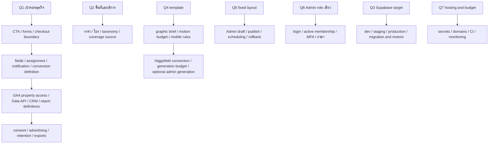

# /grill-me — decision tree

สถานะ 2026-09-30: Q1–Q5, Q8 และ Q9 ยืนยันแล้ว; ผู้ใช้ขอเพิ่มโหมดสลับภาษา TH/EN ของหน้าเว็บ (ทำใน M2); Q6/Q7 ยืนยัน role/hosting แต่ภาษา/จำนวนบัญชี/งบยังไม่ระบุ ผู้ใช้สร้าง Supabase org/project แล้วและสั่งเตรียมพร้อมส่งต่อ Claude Cloud ค่า integration ที่ยังไม่มีเสนอ default สำหรับ dev โดยยังไม่อ้างว่าอนุมัติค่าจ่ายหรือการเปิด production

## สิ่งที่ผู้ใช้ระบุแล้ว

- ยกเครื่องทั้งหน้าเว็บและหลังบ้าน มี Mirror Editor ที่หน้าตาเดียวกับ public และแก้ทุกเนื้อหาที่มองเห็นได้
- ธีมทรู ขาว แดง ดำ; ธุรกิจเน็ตบ้าน/เครือข่าย/แพ็กเกจและบริการที่เกี่ยวข้อง
- Supabase Auth, การติดตามคลิกติดต่อ, Google Analytics และรายงานการทำงานของเว็บ
- Higgsfield สำหรับภาพ/วิดีโอกราฟิกประกอบ ไม่ใช้สร้างแทนรูปสินค้า
- เลือกแบบจาก MotionSites เตรียม tools/skills/libs และทำแผนก่อนเริ่มสร้าง
- เลือก A+B+C: Minimal Workflow SaaS เป็นแนวทางหน้าเปิด, SaaS Pricing Flow เป็นส่วนแพ็กเกจ และ NEX Robotics ให้ composition คลีน/ภาพเด่น
- Mirror Editor แก้ทุกค่า แต่คงโครง layout ที่พัฒนาตกลงไว้ ไม่ทำเครื่องมือลากจัดหน้า เพิ่ม/เรียง/ซ่อน sections อิสระ
- หลังบ้านมี Admin role เดียว สำหรับดูแลคอนเทนต์และตรวจด้าน IT ไม่แยก Editor/Publisher/Sales/Analyst จำนวนบัญชีและภาษาไม่ได้ระบุ
- Hosting ใช้ Vercel และโดเมนที่ผู้ใช้ซื้อไว้แล้ว; ยังไม่ย้าย DNS หรือเลือกแพ็กเกจที่มีค่าใช้จ่าย
- เพิ่มภาพเด่น Router Wi-Fi ของทรู ผู้ใช้ให้เลือก Three.js/Higgsfield/วิธีอื่นตามคุณภาพ ไม่ใช่กล่อง TrueID TV; exact SKU ยังไม่ระบุ
- ยืนยันรับผู้สนใจให้เจ้าหน้าที่ติดต่อกลับ ไม่ทำ checkout/payment; รับคำขอทั่วประเทศไทยและคงโซลาร์เซลล์ W&W Energy
- ยืนยันแยก Supabase สำหรับเว็บนี้ ผู้ใช้สร้าง organization **telemart-ubon** (`pfvlbpujcoqiqziehstu`) และ project **Jaycop-AFK's Project** (`wdcbbjvxrcxuaabcipqo`) Free แล้ว; project อยู่ Sydney (`ap-southeast-2`) ACTIVE_HEALTHY PostgreSQL 17.6 ยังไม่มี public tables เมื่อเช็ก ไม่ใช้โปรเจกต์ truefiberhome เดิม

## รอบ 1: จุดตัดสินใจต้นทาง

| Q | คำถาม | คำแนะนำของทีม | สถานะ |
|---|---|---|---|
| Q1 | เป้าหมายหลักของเว็บ? | lead/contact-back | ยืนยันรับผู้สนใจให้ติดต่อกลับ |
| Q2 | พื้นที่และบริการที่คงไว้? | รับคำขอทั่วไทย; ตรวจ fibre coverage/งานติดตั้งรายที่อยู่ | ยืนยันทั่วประเทศและคงโซลาร์เซลล์ |
| Q3 | Supabase target? | แยกโปรเจกต์ Telemart; dev/production ไม่ปนข้อมูล | อนุญาตแยกและให้ทีมเลือกโครงสร้าง; Q9 ยืนยัน organization ใหม่ Telemart |
| Q4 | แนวทางดีไซน์ A/B/C/D หรือผสมแบบไหน? | A+B+C — หน้าเปิดสะอาด + เปรียบเทียบแพ็กเกจ + ภาพเด่นคลีน | ยืนยัน A+B+C ตามคำตอบล่าสุด |
| Q5 | Mirror Editor ต้องอิสระระดับไหน? | ข้อเสนอแรกเคยเป็นจัด sections ได้; คำตอบผู้ใช้มีผลเหนือข้อเสนอนี้ | ยืนยันแก้ทุกค่า แต่คง layout เดิม |
| Q6 | ผู้ใช้หลังบ้านและภาษา? | Admin role เดียวตามคำตอบ; ภาษาไทยเป็นข้อเสนอเริ่มต้นที่ยังไม่ยืนยัน | ยืนยัน Admin สำหรับ content + IT; ภาษา/จำนวนบัญชียังไม่ระบุ |
| Q7 | Hosting/งบ recurring และงบผลิตกราฟิก? | Vercel ตามคำตอบ; แยก preview/production และประเมินค่าบริการก่อนใช้ paid resources | ยืนยัน Vercel + โดเมนที่ซื้อไว้; งบยังไม่ระบุ |
| Q8 | กล่องที่ต้องการทำ hero visual เป็น Router Wi-Fi หรือ TrueID TV? | แยกอุปกรณ์ก่อนสร้างโมเดล; รูปเดิมมีทั้งสองชนิด | ยืนยัน Router Wi-Fi ของทรู; วิธีเลือกตามคุณภาพ |
| Q9 | Organization ของ Supabase ใหม่? | ใช้ org แยกและตรวจค่าใช้จ่าย | ผู้ใช้สร้าง `telemart-ubon` Free และ project ข้างต้นแล้ว; ตรวจ ID ผ่าน MCP |

### ผลจากคำตอบ

- ตัด free-form page builder และ dependency drag/drop สำหรับการย้าย sections ออกจากขอบเขต
- คง field registry, shared renderer, responsive preview, draft/publish/revisions/rollback และ audit; Admin คนเดียวในเชิง role มีสิทธิเผยแพร่ได้ ไม่ต้องมีอีก role มาอนุมัติ
- CRUD แพ็กเกจ/สื่อยังเป็นการจัดการข้อมูล; โครง section และ breakpoints ถูกควบคุมใน code ไม่ให้ editor แก้ arbitrary layout/code
- Requirements ต้นทางตอบแล้ว; ยังต้องสรุป integration/ค่าใช้จ่ายและ shared understanding ก่อน M1 ไม่เริ่ม build ใหม่จากเพียงการเลือก org หรือการตอบขอบเขตบางข้อ
- เรียกอ่าน prompt A/B/C แล้ว MotionSites แจ้ง premium_prompt/locked ทั้งสาม บัญชีปัจจุบันยังไม่มีสิทธิอ่าน prompt เต็ม ไม่ได้ซื้อสมาชิกหรือ bypass access; ภาพสาธารณะใช้เป็นแนวทางของงานออกแบบใหม่ได้
- ข้อเสนอภาพเด่นใช้ optimized 3D Router Wi-Fi พร้อม static poster fallback; ไม่มีโมเดลจริงใน repo ยังต้องผลิตและตรวจ ไม่ถือว่าติดตั้ง library แล้วคือได้โมเดลสำเร็จ
- วิธีแก้ Premium ที่เสนอ: ใช้ Rocket Pricing ซึ่งเรียกอ่าน prompt เต็มได้จริงแบบ Free แล้ว (เหลือ 2/3 free openings ตอนตรวจ) เป็นฐานรูปแบบเปรียบเทียบแพ็กเกจ ร่วมกับ brief Telemart ที่เขียนเองตามทิศทาง A+B+C ไม่อ่าน/คัดลอก Premium text
- รับคำขอทั่วประเทศไม่ใช่การยืนยัน fibre/solar ติดตั้งได้ทุกที่ ฟอร์มเก็บจังหวัด/รหัสไปรษณีย์เพื่อให้เจ้าหน้าที่ตรวจพื้นที่และเงื่อนไขจริง
- Supabase MCP อ่าน organization/project ที่ผู้ใช้สร้างแล้วได้ด้วย ID, read-only SQL และ Security Advisors ผ่าน (`lints=[]`); ไม่มีการสร้าง project ซ้ำหรือย้าย region ชื่อที่ผู้ใช้ตั้งจริงต่างจากชื่อเสนอเดิม การเชื่อมแอป, schema, Auth, RLS และ tests ยังเป็นงาน M1 ข้างหน้า

## ค่าเริ่มต้นที่เลือกระหว่าง M1 (2026-09-29, แก้ได้)

ค่าต่อไปนี้เป็นการตัดสินใจเชิง implementation เพื่อให้ M1 ใช้งานได้และทดสอบได้ ไม่ใช่คำตอบทางธุรกิจ เปลี่ยนได้เมื่อเจ้าของต้องการ ผลทดสอบอยู่ใน [M1-FOUNDATION.md](M1-FOUNDATION.md)

- โครง route: หน้าเดิมอยู่ใน route group `(public)` (URL เดิมทุกหน้า), หลังบ้านอยู่ที่ `/admin`, ลิงก์อีเมลที่ `/auth/confirm`; Google Ads tag, Tawk และ Prompt font โหลดเฉพาะหน้าสาธารณะ
- UI stack: คง Tailwind 3.4 + MUI 6 + framer-motion 11 สำหรับหน้าเดิมจนกว่า M2 จะสร้างหน้าใหม่; design tokens เป็น CSS variables จึงใช้ต่อได้ทั้ง Tailwind 3 และ 4 การย้าย Tailwind 4/เลิกใช้ MUI ตัดสินใน M2
- เครื่องมือ: ESLint 9 (ESLint 10 ยังติด peer ของ plugins ใน eslint-config-next), TypeScript 5.9 (ยังไม่ประเมิน TypeScript 7), Vitest + Playwright, Supabase CLI แบบ pin ใน devDependencies
- Auth: อีเมล + รหัสผ่าน แบบ invite-only (ปิดสมัครเอง); รหัสผ่านอย่างน้อย 12 ตัวอักษร มีตัวพิมพ์เล็ก/ใหญ่/ตัวเลข; เปลี่ยนรหัสผ่านแล้วออกจากระบบทุกอุปกรณ์; ลิงก์เชิญ/ลืมรหัสผ่านแบบ token hash ใช้ได้ในทุก browser; ยังไม่เปิด MFA (รอยืนยัน policy ก่อนใช้งานจริง)
- สิทธิ์: `admin_memberships` เป็นแหล่งสิทธิ์หลัก ตรวจทุกคำขอด้วย RLS; ให้/ถอนสิทธิ์ผ่าน `private.grant_admin` / `private.revoke_admin` ใน SQL editor หรือ service role; ทุกการเปลี่ยนสิทธิ์ถูกบันทึกใน `audit_log` ซึ่งแก้/ลบไม่ได้
- หลังบ้านใช้ภาษาไทยและ IBM Plex Sans Thai ตาม brief; หน้าหลังบ้านไม่ถูก index/cache/frame โดยเว็บอื่น

## ค่าเริ่มต้นที่เลือกระหว่าง M2 (2026-09-30, แก้ได้)

การตัดสินใจเชิง implementation ของ M2 ไม่ใช่คำตอบทางธุรกิจ ผลและรายการที่รอยืนยันอยู่ใน [M2-PUBLIC-SITE.md](M2-PUBLIC-SITE.md)

- ภาษา (ผู้ใช้ขอโหมด TH/EN): ภาษาไทยอยู่ที่ URL เดิมทุกหน้า ภาษาอังกฤษอยู่ใต้ `/en`; ปุ่มสลับเป็นลิงก์ธรรมดาไปหน้าเดียวกันในอีกภาษา (สองภาษาเป็นคนละ root layout จึงใช้ client navigation ข้ามกันไม่ได้); `hreflang` th/en และ `x-default` เป็นไทย; `/th/*` redirect ไป URL ไทยเดิม; ข้อตกลงฉบับอังกฤษเป็นคำแปล ถ้าขัดกันให้ถือฉบับไทย
- เนื้อหาใน M2 เก็บใน repo (`src/content`) ด้วย schema เดียวกับที่ M3 จะย้ายไป Supabase (draft/published) ทุกข้อความต้องมีทั้ง `th` และ `en`; build ล้มถ้า reference เสีย
- UI stack: คง Tailwind 3.4 บน tokens ของ M1; เลิกใช้ MUI/Emotion/framer-motion/Swiper และ carousel อื่นทั้งหมด (brief ไม่ใช้ auto-carousel); ฟอนต์ IBM Plex Sans Thai
- `/SoonContent` (หน้า placeholder ที่ไม่มีลิงก์ไปถึง) redirect ถาวรไปหน้าแรก
- ปลายทางปุ่ม: ปุ่มแพ็กเกจ “สนใจแพ็กเกจนี้” → LINE ฝ่ายขาย (`lineSales`) เหมือนเว็บเดิม; ปุ่มใน header/hero → หน้าติดต่อ; ฟอร์มขอให้ติดต่อกลับทำใน M5 แล้วจึงเปลี่ยนปุ่ม header เป็น “ให้เจ้าหน้าที่ติดต่อกลับ” ตาม brief
- Google Ads: คง base tag `AW-18007307609`; ~~เลิกยิง event `conversion` ทุกครั้งที่เปิดหน้าแรก~~ เจ้าของสั่งคืนเมื่อ 2026-10-01 (ดูหัวข้อถัดจาก R1); Tawk live chat คงไว้แต่โหลดหลังหน้าว่าง
- แพ็กเกจ: แสดงรายการ `unverified` ใน dev/preview, ซ่อนรายการ `hidden` ที่ข้อมูลขัดกัน; ก่อน launch ต้องยืนยันราคาหรือกำหนดนโยบายแสดงรายการที่ยังไม่ยืนยัน
- Hero: ภาพ Router Wi-Fi แบบ concept (ภาพนิ่ง SVG + โมเดล procedural three.js สัดส่วนเดียวกัน) พร้อมคำบรรยายว่าไม่ใช่รุ่นจริง; 3D โหลดเฉพาะเมื่อมี WebGL2, ไม่เปิด reduced motion/Save-Data; ไม่ใช้ `@react-three/drei`
- 404 ใช้ `global-not-found` แสดงสองภาษาพร้อมกัน

## ค่าเริ่มต้นที่เลือกระหว่าง M3 (2026-09-30, แก้ได้)

การตัดสินใจเชิง implementation ของ Mirror Editor ไม่ใช่คำตอบทางธุรกิจ ผลทดสอบและวิธีใช้อยู่ใน [M3-MIRROR-EDITOR.md](M3-MIRROR-EDITOR.md)

- ร่างเก็บแยกต่อเอกสาร: `site`, `page:<id>`, `package:<id>`, `media:<id>`, `benefit:<id>` (ตาราง `content_drafts` หนึ่งแถวต่อเอกสารที่ถูกแก้) เพื่อให้ Admin สองคนแก้คนละหน้า/คนละแพ็กเกจได้โดยไม่ชนกัน; แพ็กเกจยังเป็น JSON document ตาม schema เดิม (ARCHITECTURE.md §5 เสนอ relational catalog — ค่อยแยกเมื่อต้องกรอง/รายงานใน M4–M5)
- Autosave หลังหยุดพิมพ์ 0.8 วินาที ต่อเอกสาร ด้วย optimistic concurrency (revision ที่คาดไว้) ถ้าชนกันหยุดบันทึกเอกสารนั้นจนกว่า Admin เลือก “ใช้ฉบับของฉัน (บันทึกทับ)” หรือ “ใช้ฉบับล่าสุดในระบบ” ไม่มีการทับแบบเงียบ
- ตัวอย่างเป็น iframe โดเมนเดียวกันที่ `/admin/preview/<ภาษา>/<หน้า>` เพื่อให้ breakpoint ตรงกับจอจริง (เดสก์ท็อป 1280, แท็บเล็ต 834, มือถือ 390) สื่อสารด้วย `postMessage` ที่ตรวจ origin/หน้าต่าง/channel/schema; โหมดแก้ไขแสดงภาพนิ่งของ Router Wi-Fi แทนโมเดล 3D (คลิกเลือกได้) ส่วนโหมดดูหน้าเว็บแสดง 3D เหมือนจริง
- ช่องที่ editor ไม่ให้แก้: `id` (รวมรหัสติดตามคลิกของปุ่ม), `path`, หมวด/กลุ่มแพ็กเกจ, `layout`, ไฟล์/ขนาด/ชนิดของรูป, ที่มาของข้อมูล และ Google Ads ID กับสคริปต์ Tawk ใน `integrations` — กันการใส่สคริปต์จากหลังบ้านตาม ARCHITECTURE.md §3 (ตั้งแต่ 2026-10-01 แก้ `send_to` ของ conversion หน้าแรกได้ ดูหัวข้อถัดจาก R1)
- รายการ: เพิ่ม/ลบ/เรียงได้เฉพาะบรรทัดข้อความ (รายละเอียด เงื่อนไข หมายเหตุ ย่อหน้า บันทึกการตรวจ); รายการแบบวัตถุ (FAQ เมนู การ์ด ขั้นตอน ลิงก์ footer แพ็กเกจเด่น สิทธิประโยชน์ของแพ็กเกจ) แก้ค่าได้แต่จำนวน/ลำดับคงที่จนกว่าเจ้าของจะตัดสินคำถามที่เปิดอยู่
- ลิงก์ที่หน้าเว็บเปิดจากเนื้อหา (LINE, เฟซบุ๊ก, ปุ่มไปเว็บอื่น, สคริปต์แชต) ต้องเป็น `https://` บนโดเมนจริง
- ราคาปกติ: เมื่อเปิด “แสดงราคาปกติแบบขีดฆ่า” ช่องเริ่มเท่าราคาเสนอซึ่งบันทึกไม่ได้ Admin ต้องพิมพ์ราคาจริงเอง editor ไม่สร้างตัวเลขให้
- รูป: เลือกจากคลังสื่อที่นำเข้าแล้วเท่านั้น การอัปโหลดรูปใหม่ (Supabase Storage + RLS + ตรวจไฟล์) เลื่อนไป M4
- การเผยแพร่ ประวัติ และย้อนกลับเป็น M4; ระหว่างนี้หน้าเว็บจริงยังอ่านเนื้อหาใน `src/content`
- หลังบ้านและข้อความ error ภาษาไทยทั้งหมด; editor ออกแบบสำหรับจอกว้าง ≥ 1024 px

## ค่าเริ่มต้นที่เลือกระหว่าง R1 (2026-10-01, แก้ได้)

ผู้ใช้ดู UI ของ M3 แล้วขอออกแบบใหม่ก่อน M4: หน้าแรกเปิดแบบหนังเลื่อนแล้วเล่นที่เล่าเรื่องเน็ตบ้าน/ไฟเบอร์/เครือข่ายทรู ตามด้วยโปรแนะนำ หน้ารองคล้าย true.th/true-online แต่เลือกง่ายกว่า และ CRUD สินค้าบริการทั้งหมด งานแบ่งเป็น R1–R4 รายละเอียด R1 ใน [R1-HOME-FILM.md](R1-HOME-FILM.md)

- หนังเปิดหน้า 3 ฉากแทน hero เดิม; ภาพ Router Wi-Fi ย้ายไปส่วน "อุปกรณ์ Wi-Fi" ถัดจากโปรแนะนำและยังเป็นภาพสินค้าที่เด่นของหน้า
- เล่นจากชุดเฟรม AVIF บน canvas แทนการ seek วิดีโอ: ทุกเบราว์เซอร์เลื่อนไปกลับได้ลื่น ไม่พึ่ง codec ของเบราว์เซอร์ และควบคุมการโหลดได้ (ภาพนิ่งก่อน, หยาบไปละเอียด, Save-Data โหลดแค่ภาพนิ่ง)
- ปุ่มหลัก/รองและข้อความ "รับเรื่องจากทุกจังหวัด…" อยู่บนจอตลอดหนัง มีปุ่มข้ามหนังและปุ่มเลือกฉาก
- ไม่มี JavaScript, reduced motion และ Mirror Editor แสดงฉากเป็นแผงนิ่งที่สูงเท่า layout หนัง (เนื้อหาไม่กระโดดเมื่อหนังเริ่ม และ editor/public เทียบภาพกันได้)
- หนังชั่วคราววาดด้วยโค้ด และมีคำกำกับ "ภาพประกอบ ไม่ใช่ภาพเครือข่ายจริง" จนกว่าวิดีโอจาก Google Flow ผ่านการตรวจ
- ไม่มี Google Flow MCP connector ให้เชื่อม: ผู้ใช้เลือกใช้ Google Drive เป็นทางส่งไฟล์ Claude เขียนบรีฟและ prompt ทุกช็อต ตรวจทุกไฟล์ที่ส่งมา และแปลงเป็นเฟรมเอง (`scripts/media/film-frames.mjs`)
- สี ink เป็นกรมท่า `#0e1630` เพิ่มสีรอง glow `#5b3fd1` (แก้ได้ ตรวจ contrast) หัวเรื่องใช้ Anuphan ส่วนเนื้อหายังเป็น IBM Plex Sans Thai
- Content schema รุ่น 2 (`hero.film/beats`, `equipment`, `media.sequence`)

## ค่าเริ่มต้นที่เลือกระหว่าง R2 (2026-10-01, แก้ได้)

รายละเอียดใน [R2-HOME-PROMOS.md](R2-HOME-PROMOS.md)

- ส่วน "แพ็กเกจเด่น" กลายเป็น "โปรแนะนำ" แบบแท็บ 4 หมวด (เน็ตบ้าน / มือถือรายเดือน / เติมเงิน / โซลาร์) การ์ดมีรูปเลื่อนข้าง ต่อจากหนังทันทีบนพื้นกรมท่า
- การ์ดอ้างแพ็กเกจจาก catalog ด้วยรหัส ราคาและเงื่อนไขไม่ถูกคัดลอกหรือแต่งเพิ่ม รูปเลือกต่อการ์ด; แพ็กเกจในแต่ละแท็บเป็นตัวเลือกเริ่มต้นที่เจ้าของเปลี่ยนได้
- รูปการ์ดและการ์ดบริการชั่วคราวใช้ภาพเดิมของเว็บเก่าที่ไม่มีตัวอักษร/ราคา (ลักษณะ AI ชนิด `generated` รอยืนยันสิทธิ์) จนกว่าจะได้ S1–S8 จาก Google Flow ภาพเก่าที่มีราคาติดอยู่ไม่ใช้
- ไม่มี JavaScript แสดงทุกแท็บเรียงกัน; Mirror editor แสดงทุกแท็บเรียงกันเพื่อคลิกแก้การ์ดได้ทุกใบ
- Content schema รุ่น 3 (`promos`, `services.items[].image`, ui `packageDetails`/`scrollPrevious`/`scrollNext`)

## ค่าเริ่มต้นที่เลือกระหว่าง R3 (2026-10-01, แก้ได้)

รายละเอียดใน [R3-PACKAGE-PAGES.md](R3-PACKAGE-PAGES.md)

- หน้าแพ็กเกจคงหมวดและ anchor เดิม เพิ่มกล่องค้นหา (ความเร็วแบบปุ่ม, ราคาไม่เกิน, มีสิทธิประโยชน์, เรียงตาม) ที่กรอง/เรียงภายในหมวด ตัวเลือกคำนวณจากข้อมูลของหน้า ไม่มีค่าให้ตั้ง
- เปรียบเทียบได้ครั้งละ 2–3 แพ็กเกจในหน้าเดียวกัน ตารางใน dialog
- หน้ารายละเอียดที่ `/packages/<รหัส>` (static ทุกแพ็กเกจที่แสดง, อยู่ใน sitemap) ปุ่มติดต่อเป็นปุ่มของหน้าแพ็กเกจ (LINE) + โทรหาฝ่ายขาย จนกว่า M5; แพ็กเกจที่ราคายังไม่ยืนยันมีหมายเหตุบอกให้ยืนยันกับเจ้าหน้าที่ และหมายเหตุของหมวดตามไปด้วย
- ไม่มี JavaScript ซ่อนตัวกรองและช่องเปรียบเทียบ แสดงทุกแพ็กเกจ

## ค่าเริ่มต้นที่เลือกระหว่าง R4 (2026-10-02, แก้ได้)

รายละเอียดใน [R4-CATALOG-AND-MEDIA.md](R4-CATALOG-AND-MEDIA.md)

- เพิ่ม/ลบเป็นร่างเหมือนการแก้ปกติ (เอกสารใหม่ / tombstone) ลำดับแพ็กเกจเป็นเอกสาร `catalog` แยก
- แพ็กเกจใหม่เริ่มซ่อนและราคา 0 ไม่คัดลอกราคาหรือเงื่อนไขจากแพ็กเกจอื่น; แพ็กเกจที่แสดงต้องมีราคา
- รายการในหน้าเพิ่มโดยคัดลอกรายการสุดท้าย (id ใหม่ทั้งหมด) แล้วแก้ ตามขอบเขตจำนวนใน schema
- รูปอัปโหลดแปลงเป็น WebP กว้างไม่เกิน 2400 px ชื่อไฟล์สุ่มไม่ทับของเดิม ยังไม่ลบไฟล์ออกจาก Storage
- GA4 (`G-DQGCC5J4YM`, เจ้าของส่ง 2 ต.ค.) โหลดผ่าน gtag.js เดียวกับ Google Ads และตั้งค่าเฉพาะบนโดเมน production; ID อยู่ใน `site.integrations` แก้จากหลังบ้านไม่ได้ (เหมือน Google Ads ID) — consent ตาม PDPA มากับ M5

## คำสั่งเจ้าของหลัง R1 (2026-10-01)

- Google Ads conversion หน้าแรก: เจ้าของสั่งคืนพฤติกรรมเว็บเดิม (commit `9b768a6`) — ยิง `conversion` (`value` 1.0 THB) ครั้งเดียวต่อการเปิดหน้าแรก `/` และ `/en` ทั้งโหลดหน้าใหม่และกดกลับหน้าแรกจากหน้าอื่น หลังแท็กตั้งค่า (`config`) แล้วเสมอ ไม่ยิงในหน้าอื่น, `/admin/preview` และ editor
- ยิงเฉพาะเมื่อเปิดบนโดเมน production (host ของ `siteUrl()` คือ `www.telemartubon.com`; โดเมนเปล่า redirect 308 ไป www) เครื่อง dev, Vercel Preview และ URL `*.vercel.app` ไม่ยิง เพื่อไม่ให้ตัวเลขใน Google Ads ปนการทดสอบ (เจ้าของเลือก 2026-10-01)
- ค่า `send_to` อยู่ที่ `site.integrations.googleAdsHomeConversion` แก้ได้ใน Mirror editor (ปุ่ม “ตั้งค่าทั้งเว็บ” › การเชื่อมต่อ) แต่ต้องเป็นรูปแบบ `AW-ตัวเลข/รหัส` ของบัญชีเดียวกับ Google Ads ID ของแท็ก; Google Ads ID และสคริปต์ Tawk ยังแก้จากหลังบ้านไม่ได้ ค่านี้ส่งเข้า `gtag()` เป็นข้อมูล ไม่ได้ต่อเป็นสคริปต์
- ฟอนต์ย้ายจาก `next/font/google` มาเก็บใน repo (`src/fonts`, นิยามที่เดียว) เพราะ build ล้มเป็นบางครั้ง: IBM Plex Sans Thai ใช้ไฟล์ทางการของ IBM ไม่ subset (Reserved Font Name "Plex") และไม่ใส่ Bold ที่ไม่มีที่ใช้; Anuphan ตัดเหลือแกน 500–700 และอักษรไทย/ละตินชุดเดิม (OFL ไม่มี RFN) หน้าเว็บโหลดฟอนต์ 4 ไฟล์ 162 kB จากเดิม 10 ไฟล์ 137 kB รายละเอียดใน `src/fonts/README.md`
- การนับการเปิดหน้าเป็น conversion ยังมีข้อจำกัดตาม CURRENT-SITE-AUDIT.md (นับการเข้าชมธรรมดาเป็น conversion) M5 ยังต้องกำหนด conversion จากการส่งฟอร์ม/คลิกติดต่อ และ consent ตาม PDPA

## ต้นไม้ของรอบถัดไป (ยังไม่ถามจน prerequisite ชัด)

ทีมตรวจ facts จาก code/tools/docs เอง ส่วนธุรกิจ/สิทธิ์เจ้าของ/งบ/การตัดสินใจที่ facts ไม่ตอบ ต้องรับคำตอบผู้ใช้ ทุกค่าแนะนำเป็นข้อเสนอไม่ใช่คำตอบที่ยืนยัน

ขั้นสรุปสุดท้าย: ปรับ PLAN.md ให้ตรงทุกคำตอบ แล้วให้ผู้ใช้ยืนยัน shared understanding ก่อนเริ่ม M1 ตาม [grilling skill](../../.agents/skills/grilling/SKILL.md): “Do not act on it until the user confirms you have reached a shared understanding.”
