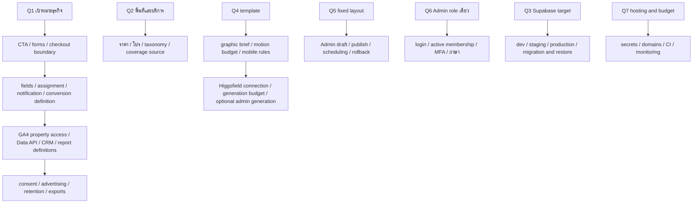

# /grill-me — decision tree

สถานะ 2026-09-30: Q1–Q5, Q8 และ Q9 ยืนยันแล้ว; Q6/Q7 ยืนยัน role/hosting แต่ภาษา/จำนวนบัญชี/งบยังไม่ระบุ ผู้ใช้สร้าง Supabase org/project แล้วและสั่งเตรียมพร้อมส่งต่อ Claude Cloud ค่า integration ที่ยังไม่มีเสนอ default สำหรับ dev โดยยังไม่อ้างว่าอนุมัติค่าจ่ายหรือการเปิด production

## สิ่งที่ผู้ใช้ระบุแล้ว

- ยกเครื่องทั้งหน้าเว็บและหลังบ้าน มี Mirror Editor ที่หน้าตาเดียวกับ public และแก้ทุกเนื้อหาที่มองเห็นได้
- ธีมทรู ขาว แดง ดำ; ธุรกิจเน็ตบ้าน/เครือข่าย/แพ็กเกจและบริการที่เกี่ยวข้อง
- Supabase Auth, การติดตามคลิกติดต่อ, Google Analytics และรายงานการทำงานของเว็บ
- Higgsfield สำหรับภาพ/วิดีโอกราฟิกประกอบ ไม่ใช้สร้างแทนรูปสินค้า
- เลือกแบบจาก MotionSites เตรียม tools/skills/libs และทำแผนก่อนเริ่มสร้าง
- เลือก A+B+C: Minimal Workflow SaaS เป็นแนวทางหน้าเปิด, SaaS Pricing Flow เป็นส่วนแพ็กเกจ และ NEX Robotics ให้ composition คลีน/ภาพเด่น
- Mirror Editor แก้ทุกค่า แต่คงโครง layout ที่พัฒนาตกลงไว้ ไม่ทำเครื่องมือลากจัดหน้า เพิ่ม/เรียง/ซ่อน sections อิสระ
- หลังบ้านมี Admin role เดียว สำหรับดูแลคอนเทนต์และตรวจด้าน IT ไม่แยก Editor/Publisher/Sales/Analyst จำนวนบัญชีและภาษาไม่ได้ระบุ
- Hosting ใช้ Vercel และโดเมนที่ผู้ใช้ซื้อไว้แล้ว; ยังไม่ย้าย DNS หรือเลือกแพ็กเกจที่มีค่าใช้จ่าย
- เพิ่มภาพเด่น Router Wi-Fi ของทรู ผู้ใช้ให้เลือก Three.js/Higgsfield/วิธีอื่นตามคุณภาพ ไม่ใช่กล่อง TrueID TV; exact SKU ยังไม่ระบุ
- ยืนยันรับผู้สนใจให้เจ้าหน้าที่ติดต่อกลับ ไม่ทำ checkout/payment; รับคำขอทั่วประเทศไทยและคงโซลาร์เซลล์ W&W Energy
- ยืนยันแยก Supabase สำหรับเว็บนี้ ผู้ใช้สร้าง organization **telemart-ubon** (`pfvlbpujcoqiqziehstu`) และ project **Jaycop-AFK's Project** (`wdcbbjvxrcxuaabcipqo`) Free แล้ว; project อยู่ Sydney (`ap-southeast-2`) ACTIVE_HEALTHY PostgreSQL 17.6 ยังไม่มี public tables เมื่อเช็ก ไม่ใช้โปรเจกต์ truefiberhome เดิม

## รอบ 1: จุดตัดสินใจต้นทาง

| Q | คำถาม | คำแนะนำของทีม | สถานะ |
|---|---|---|---|
| Q1 | เป้าหมายหลักของเว็บ? | lead/contact-back | ยืนยันรับผู้สนใจให้ติดต่อกลับ |
| Q2 | พื้นที่และบริการที่คงไว้? | รับคำขอทั่วไทย; ตรวจ fibre coverage/งานติดตั้งรายที่อยู่ | ยืนยันทั่วประเทศและคงโซลาร์เซลล์ |
| Q3 | Supabase target? | แยกโปรเจกต์ Telemart; dev/production ไม่ปนข้อมูล | อนุญาตแยกและให้ทีมเลือกโครงสร้าง; Q9 ยืนยัน organization ใหม่ Telemart |
| Q4 | แนวทางดีไซน์ A/B/C/D หรือผสมแบบไหน? | A+B+C — หน้าเปิดสะอาด + เปรียบเทียบแพ็กเกจ + ภาพเด่นคลีน | ยืนยัน A+B+C ตามคำตอบล่าสุด |
| Q5 | Mirror Editor ต้องอิสระระดับไหน? | ข้อเสนอแรกเคยเป็นจัด sections ได้; คำตอบผู้ใช้มีผลเหนือข้อเสนอนี้ | ยืนยันแก้ทุกค่า แต่คง layout เดิม |
| Q6 | ผู้ใช้หลังบ้านและภาษา? | Admin role เดียวตามคำตอบ; ภาษาไทยเป็นข้อเสนอเริ่มต้นที่ยังไม่ยืนยัน | ยืนยัน Admin สำหรับ content + IT; ภาษา/จำนวนบัญชียังไม่ระบุ |
| Q7 | Hosting/งบ recurring และงบผลิตกราฟิก? | Vercel ตามคำตอบ; แยก preview/production และประเมินค่าบริการก่อนใช้ paid resources | ยืนยัน Vercel + โดเมนที่ซื้อไว้; งบยังไม่ระบุ |
| Q8 | กล่องที่ต้องการทำ hero visual เป็น Router Wi-Fi หรือ TrueID TV? | แยกอุปกรณ์ก่อนสร้างโมเดล; รูปเดิมมีทั้งสองชนิด | ยืนยัน Router Wi-Fi ของทรู; วิธีเลือกตามคุณภาพ |
| Q9 | Organization ของ Supabase ใหม่? | ใช้ org แยกและตรวจค่าใช้จ่าย | ผู้ใช้สร้าง `telemart-ubon` Free และ project ข้างต้นแล้ว; ตรวจ ID ผ่าน MCP |

### ผลจากคำตอบ

- ตัด free-form page builder และ dependency drag/drop สำหรับการย้าย sections ออกจากขอบเขต
- คง field registry, shared renderer, responsive preview, draft/publish/revisions/rollback และ audit; Admin คนเดียวในเชิง role มีสิทธิเผยแพร่ได้ ไม่ต้องมีอีก role มาอนุมัติ
- CRUD แพ็กเกจ/สื่อยังเป็นการจัดการข้อมูล; โครง section และ breakpoints ถูกควบคุมใน code ไม่ให้ editor แก้ arbitrary layout/code
- Requirements ต้นทางตอบแล้ว; ยังต้องสรุป integration/ค่าใช้จ่ายและ shared understanding ก่อน M1 ไม่เริ่ม build ใหม่จากเพียงการเลือก org หรือการตอบขอบเขตบางข้อ
- เรียกอ่าน prompt A/B/C แล้ว MotionSites แจ้ง premium_prompt/locked ทั้งสาม บัญชีปัจจุบันยังไม่มีสิทธิอ่าน prompt เต็ม ไม่ได้ซื้อสมาชิกหรือ bypass access; ภาพสาธารณะใช้เป็นแนวทางของงานออกแบบใหม่ได้
- ข้อเสนอภาพเด่นใช้ optimized 3D Router Wi-Fi พร้อม static poster fallback; ไม่มีโมเดลจริงใน repo ยังต้องผลิตและตรวจ ไม่ถือว่าติดตั้ง library แล้วคือได้โมเดลสำเร็จ
- วิธีแก้ Premium ที่เสนอ: ใช้ Rocket Pricing ซึ่งเรียกอ่าน prompt เต็มได้จริงแบบ Free แล้ว (เหลือ 2/3 free openings ตอนตรวจ) เป็นฐานรูปแบบเปรียบเทียบแพ็กเกจ ร่วมกับ brief Telemart ที่เขียนเองตามทิศทาง A+B+C ไม่อ่าน/คัดลอก Premium text
- รับคำขอทั่วประเทศไม่ใช่การยืนยัน fibre/solar ติดตั้งได้ทุกที่ ฟอร์มเก็บจังหวัด/รหัสไปรษณีย์เพื่อให้เจ้าหน้าที่ตรวจพื้นที่และเงื่อนไขจริง
- Supabase MCP อ่าน organization/project ที่ผู้ใช้สร้างแล้วได้ด้วย ID, read-only SQL และ Security Advisors ผ่าน (`lints=[]`); ไม่มีการสร้าง project ซ้ำหรือย้าย region ชื่อที่ผู้ใช้ตั้งจริงต่างจากชื่อเสนอเดิม การเชื่อมแอป, schema, Auth, RLS และ tests ยังเป็นงาน M1 ข้างหน้า

## ต้นไม้ของรอบถัดไป (ยังไม่ถามจน prerequisite ชัด)

ทีมตรวจ facts จาก code/tools/docs เอง ส่วนธุรกิจ/สิทธิ์เจ้าของ/งบ/การตัดสินใจที่ facts ไม่ตอบ ต้องรับคำตอบผู้ใช้ ทุกค่าแนะนำเป็นข้อเสนอไม่ใช่คำตอบที่ยืนยัน

ขั้นสรุปสุดท้าย: ปรับ PLAN.md ให้ตรงทุกคำตอบ แล้วให้ผู้ใช้ยืนยัน shared understanding ก่อนเริ่ม M1 ตาม [grilling skill](../../.agents/skills/grilling/SKILL.md): “Do not act on it until the user confirms you have reached a shared understanding.”
